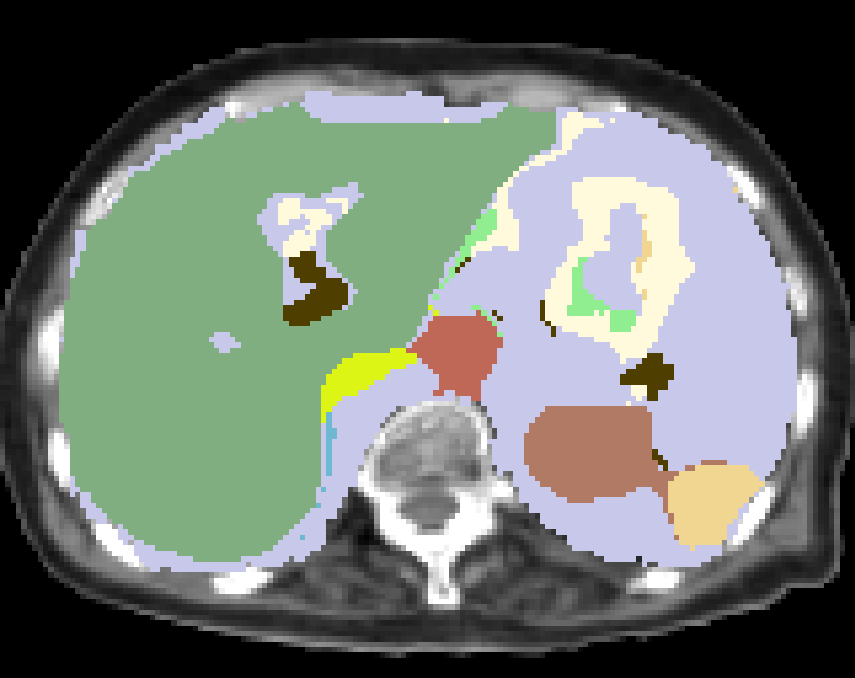

Atlas guided EM Algorithm
---------------------------------

This implementation is based on [Shimizu, A., Ohno, R., Ikegami, T. et al. (2007) Segmentation of multiple organs in non-contrast 3D abdominal CT images, Int J CARS 2: 135. https://doi.org/10.1007/s11548-007-0135-z](https://link.springer.com/article/10.1007/s11548-007-0135-z).

Note this is not official implementation.

Please use at your own responsibility.

## Requirements

Nuget package

- Eigen

- Boost

- ITK

Another library (already contained)

- [mist](https://github.com/mist-team/mist)

## Environment

- Windows 10 pro

- Visual Studio 2015

- Release x64

## Detail of data

Data I used is as follow:

Label correspondense

| Organs | Label number |
|:---:|:---:|
|others|0|
|liver|1|
|spleen|2|
|kidneyL|3|
|kidneyR|4|
|heart|5|
|gallbladder|6|
|pancreas|7|
|aorta|8|
|IVC|9|
|portal|10|
|stomachWall|11|
|oesophagus|12|

Note:
In this case, i didnt use heart label since it is not included in mask image region.

Example:

|Original|Label|Mask|
|:---:|:---:|:---:|
||||

## How to use

First of all, please build all project.

And then, please put your data into `data/preprocessed` folder.

```
data
└─preprocessed
   ├─abdominal_cavity_mask        <--- mask image e.g. region of interest image
   ├─label                        <--- label image
   └─org                          <--- original image
```

I show flow chart as bellow:


[Cite](https://www.jstage.jst.go.jp/article/mit/24/3/24_153/_pdf)

#### 1. generate_atlas

Generate atlas.

This program outputs into `results/generate_atlas`.

```
bat\generate_atlas.bat
```

#### 2. compute_features

Compute features each original image.

In this case, we calculate median image.

```
bat\compute_features.bat
```

#### 3. calc_init_val

Compute initial value for em algorithm using training data.

```
bat\calc_init_val.bat
```

#### 4. apply_em_algorithm

Apply em algorithm to test data

```
bat\apply_em_algorithm_using_atlas.bat
```

#### 5. apply_maximum_a_posteriori

Apply maximum a posteriori to test data

```
bat\apply_maximum_a_posteriori.bat
```

## Results

I show example of result.

|Predict|Ground truth|Original|
|:---:|:---:|:---:|
||||

I evaluate my result in terms of Jaccard Index.

|organs|JI|
|:---:|:---:|
|liver|0.862857|
|spleen|0.616608|
|kidneyL|0.666968|
|kidneyR|0.548733|
|gallbladder|0.187473|
|pancreas|0.35192|
|aorta|0.606638|
|IVC|0.566764|
|portal|0.0789795|
|stomachWall|0.13219|
|oesophagus|0.0801887|
|other|0.728133|
